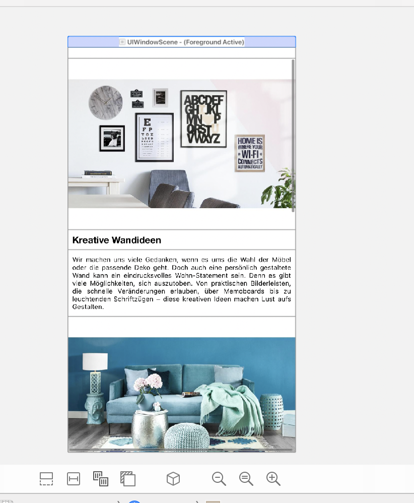

Campaign Browser
================

Loads a list of campaigns from the internet and displays them.
This project has the Custom collectionView layout which calculates the cell height at runtime and cache them so that ree caclulation does not happen

### 
### 

# Dependency Management

The project has some dependencies to third-party libraries. They are managed via [CocoaPods](https://cocoapods.org).
